# HDB Part 2: AWS Architecture for Batch Ingestion and Private Data Exploitation

> Status: this is a proposed architecture for the assessment exercise. No AWS deployment or end-to-end Tableau connection was performed. Part 1 runs locally as a notebook; the container entry points, Docker image, AWS infrastructure, and workflow described here are production implementation work. The assessment does not require Part 2 code.

This document explains two diagrams. Diagram 1 shows how HDB resale data is pulled from the public data.gov.sg website into a private AWS data lake, using two independent tasks and Step Functions to coordinate them. Diagram 2 shows how Tableau, sitting in its own private network, is allowed to query that data safely. Every design choice below has a short reason attached to it, so the reasoning can be checked, not just the picture.

## Contents

1. [What This Document Covers](#1-what-this-document-covers)
2. [Files In This Folder](#2-files-in-this-folder)
3. [The Architecture In One Diagram](#3-the-architecture-in-one-diagram)
4. [Diagram 1: Batch Ingestion From data.gov.sg](#4-diagram-1-batch-ingestion-from-datagovsg)
5. [Two Separate Tasks: Extraction And Processing](#5-two-separate-tasks-extraction-and-processing)
6. [Orchestration: Step Functions Standard, Not Express](#6-orchestration-step-functions-standard-not-express)
7. [Why Not AWS Batch](#7-why-not-aws-batch)
8. [Why Not Apache Airflow](#8-why-not-apache-airflow)
9. [Packaging: Docker And Amazon ECR](#9-packaging-docker-and-amazon-ecr)
10. [Diagram 2: Tableau Reads The Data Privately](#10-diagram-2-tableau-reads-the-data-privately)
11. [Why Two VPCs Instead Of Three](#11-why-two-vpcs-instead-of-three)
12. [Why Fargate Is Used For Extraction And Processing](#12-why-fargate-is-used-for-extraction-and-processing)
13. [IAM And KMS: Two Different Locks](#13-iam-and-kms-two-different-locks)
14. [Recovery: What Happens When A Task Fails](#14-recovery-what-happens-when-a-task-fails)
15. [Idempotency: Why Retries Must Be Safe](#15-idempotency-why-retries-must-be-safe)
16. [Incremental Ingestion: Avoiding Unnecessary Re-Downloads](#16-incremental-ingestion-avoiding-unnecessary-re-downloads)
17. [Scaling To 100 Times The Data](#17-scaling-to-100-times-the-data)
18. [Security](#18-security)
19. [Scalability](#19-scalability)
20. [Maintainability](#20-maintainability)
21. [Performance](#21-performance)
22. [Assumptions Made In This Design](#22-assumptions-made-in-this-design)
23. [Questions A Reviewer Might Ask](#23-questions-a-reviewer-might-ask)
24. [References](#24-references)

## 1. What This Document Covers

The assessment asks for the following (summarized from the brief supplied separately, which must not be uploaded to the repository):

| # | Requirement | Where it is answered |
|---|---|---|
| 1 | Batch ingestion from data.gov.sg. The design must support large files, over 100 MB. | Diagram 1, and section 12. |
| 2 | data.gov.sg is public. HDB's platform sits in private networks. Network and system segmentation must be part of the security design. | Diagram 1, section 4. |
| 3 | The Data Science Team uses Tableau on AWS, in another private network. The design must support the Athena driver. | Diagram 2, section 10. |
| 4 | Traffic between Tableau and the data must stay private. | Diagram 2, section 10. |
| 5 | Submit as PowerPoint, draw.io, or an equivalent tool, converted to PNG. | `HDB_Part2_Architecture.drawio`, exported to `01_ingestion.png` and `02_exploitation.png`. |

The assessment does not say how many networks to use, which compute service to pick, which orchestration tool to run, or how many encryption keys to have. Those are engineering decisions. Each one is explained below, along with the condition under which it should change, and the alternative that was considered instead.

## 2. Files In This Folder

| File | What it is |
|---|---|
| `HDB_Part2_Architecture.drawio` | The editable diagram source. Two pages, built with real AWS icons. Open it at app.diagrams.net to edit. |
| `01_ingestion.png` | Diagram 1, exported as an image. |
| `02_exploitation.png` | Diagram 2, exported as an image. |
| `README.md` | This document. |

## 3. The Architecture In One Diagram

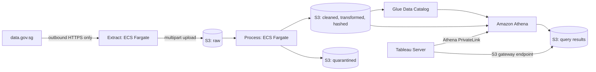

Three things to notice in this picture:

1. A file lands in `raw`, is processed into a versioned output, and is published after validation. Retries can process the same raw file again, so publication must be idempotent. Tableau never reads the ingestion side.
2. Amazon S3, Athena, and the Glue Data Catalog are drawn as plain boxes, not inside any network boundary. That is because they are AWS managed services. They live outside any VPC. A private connection to them is provided through an endpoint, but the service itself is not "inside" the customer's network.
3. Extraction and processing are two separate boxes on purpose, not one combined step. Section 5 explains why.

The five output groups required by Part 1 (raw, cleaned, transformed, quarantined, hashed) are the same five groups this architecture produces. This was checked against the real, already completed Part 1 pipeline and its output manifest, not assumed.

## 4. Diagram 1: Batch Ingestion From data.gov.sg

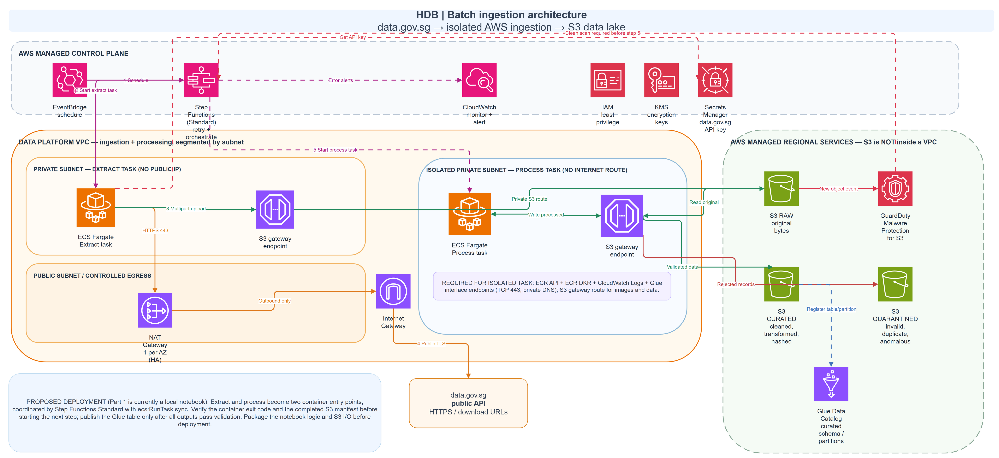

### 4.1 How The Network Is Segmented

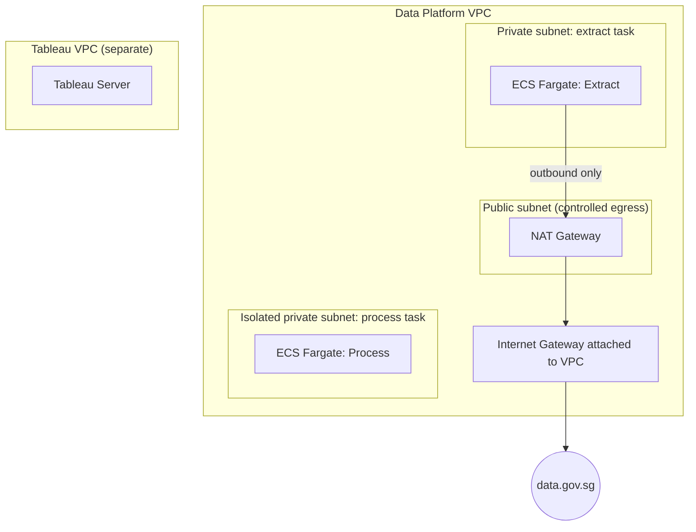

The ingestion components sit inside one Data Platform VPC. The three subnet boxes show **subnet roles**, not a complete deployable subnet inventory. For the two-AZ production layout, create a private extract subnet, an isolated process subnet, and a public NAT subnet in each AZ, with an appropriate route table for each role:

* A public subnet, whose only job is controlled outbound access. It holds the NAT Gateway. The Internet Gateway attaches to the VPC, and the public subnet's route table points to it. No application task runs in this subnet.
* A private subnet for the extract task. It has no public IP address, and the only way it reaches the internet is through the NAT Gateway next door.
* An isolated private subnet for the process task. It has no default route to the internet or NAT. Its S3 route table must include the S3 gateway endpoint. Its private service calls use interface endpoints, as listed below.

**Required private service endpoints for the isolated task:** ECR API (`ecr.api`) and ECR Docker registry (`ecr.dkr`) to pull the image, CloudWatch Logs (`logs`) for the `awslogs` driver, and AWS Glue (`glue`) if the task registers tables or partitions itself. ECR image layers also require the S3 gateway endpoint. Enable private DNS on interface endpoints and allow the task security group to reach their endpoint security groups on TCP 443. The extract task can reach these services through its NAT route, while its large S3 uploads use the gateway endpoint. If the process task calls another AWS API later, add its private endpoint or move that API call to a managed orchestration step; the no-internet claim depends on this inventory.

Tableau sits in a second, completely separate VPC, described in section 10.

### 4.2 What Each Box Means

| Box | Where it sits | What it does |
|---|---|---|
| data.gov.sg | Public internet | The source of the files. Reached through the [official dataset download API](https://guide.data.gov.sg/developer-guide/dataset-apis/download-dataset): initiate, poll, then download. |
| Amazon EventBridge | AWS managed | Starts the workflow on a schedule. |
| AWS Step Functions (Standard) | AWS managed | Starts the extract task, waits for it to finish, then starts the process task. Retries on failure. See sections 5 and 6. |
| ECS Fargate: Extract | Private subnet | Calls the data.gov.sg API, streams the file, and uploads it to S3 in parts (multipart upload), so large files never need to sit fully in memory. |
| AWS Secrets Manager | AWS managed | Holds the data.gov.sg API key. Read once by the extract task when it starts. See section 4.4. |
| NAT Gateway, Internet Gateway | NAT in public subnet; Internet Gateway attached to VPC | Give the extract task outbound internet access, without giving it a public IP address or an inbound listener. |
| S3 gateway endpoint | VPC route tables | A private path to S3, so file traffic does not need to go out through the NAT Gateway. |
| Amazon GuardDuty (Malware Protection for S3) | AWS managed | Scans every new object written to `raw` automatically, tags the result, and publishes it to EventBridge. The process task is not started until that result is clean. See section 4.5. |
| ECS Fargate: Process | Isolated private subnet | Would run an adapted version of Part 1's notebook rules: profiling, validation, lease calculation, deduplication, anomaly checks, identifier and hash generation. Produces all five output groups. |
| S3 raw, curated, quarantined | AWS managed, outside any VPC | `raw` keeps the original file bytes untouched. `cleaned`, `transformed`, and `hashed` are drawn together as one box for space, but are three separate locations. `quarantined` holds rejected or flagged rows, each with a reason. |
| Glue Data Catalog | AWS managed | Stores the table structure and file locations for the curated data, so Athena knows where to look. Updated only after a batch finishes successfully. |
| CloudWatch | AWS managed | Receives logs and metrics. An alarm or workflow failure event can notify an SNS topic; SNS is an implementation detail not drawn as a separate box. |
| IAM and KMS | Not a network location | IAM decides which action an identity may perform. KMS separately decides who may use which encryption key. These answer two different questions, which is why they are drawn as two separate icons (see section 13). |

### 4.3 How Data Moves, Step By Step

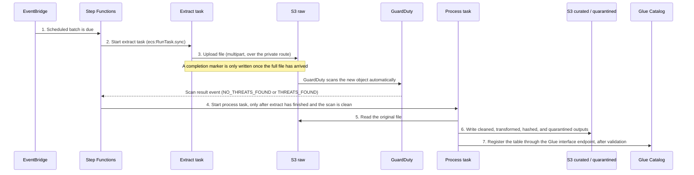

The process task starts only after the extract task has completed its multipart upload, written a completion manifest, and reported success. The workflow must verify the extract container's exit code and manifest before starting processing; waiting for an ECS task to stop alone is not a data-quality check. The Glue Data Catalog is updated only after all five outputs have been written and verified, because writing several files to S3 is not one atomic operation. The published table location should point to one validated, immutable batch prefix so a failed or concurrent run cannot expose half-finished data.

### 4.4 Storing The data.gov.sg API Key

data.gov.sg's dataset API can be called without a key, but anonymous calls have a lower quota. Its [current rate-limit page](https://guide.data.gov.sg/developer-guide/api-overview/api-rate-limits) lists dataset downloads at two calls per ten seconds without a key; the [download guide](https://guide.data.gov.sg/developer-guide/dataset-apis/download-dataset) still mentions five requests per minute, so production code should treat `429` and any `Retry-After` header as authoritative rather than hard-code either figure. For scheduled runs, use a production API key and bounded backoff. Three datasets can consume several initiate and poll calls before the file URLs are ready.

That key is a secret. It is stored in AWS Secrets Manager, not baked into the container image, not placed in a plain environment variable, and not committed to source control anywhere.

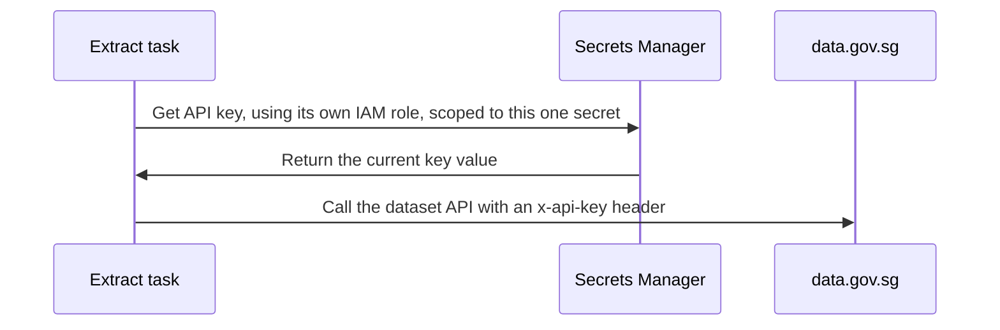

The extract task's IAM role can read exactly this one secret, as well as write its raw S3 prefix. The process task never touches the secret, since it never calls data.gov.sg.

### 4.5 Scanning Incoming Files For Malicious Content

The completion marker and manifest in section 4.3 confirm a file arrived intact. That is not the same as confirming its content is safe. A checksum only proves the bytes match a previous download; it says nothing about whether those bytes are malicious, since a compromised or spoofed source could still produce a file that is internally consistent and passes every integrity check described so far.

Amazon GuardDuty Malware Protection for S3 is enabled on the `raw` bucket only, since that is the one location in this design that receives files from the public internet. It needs no S3 Event Notification configured separately: once a bucket is added to a Malware Protection plan, GuardDuty scans automatically whenever a new object, or a new version of an existing object, is uploaded. On completion it tags the object with a `GuardDutyMalwareScanStatus` key (`NO_THREATS_FOUND` or `THREATS_FOUND`) and publishes the same result to the account's default EventBridge event bus.

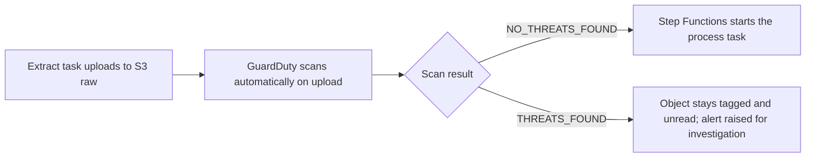

Because the result arrives as an asynchronous EventBridge event rather than a synchronous API response, Step Functions has to wait for it the same way it waits for anything else external: through a task-token callback (`waitForTaskToken`), which, like the `ecs:RunTask.sync` pattern in section 6, is only available in Standard Workflows. This is a second, independent reason Standard is required here, not only the ECS integration.

The GuardDuty service role needs `s3:GetObject` and `s3:PutObjectTagging` on the raw prefix to scan and tag objects. Since raw objects are SSE-KMS encrypted in this design, it also needs `kms:Decrypt` on the raw key specifically, granted the same way any other reader of that key is granted it (section 13).

This control is scoped to `raw` only. The curated and quarantined outputs are generated internally by the process task's own code, not downloaded from the internet, so they sit outside this specific threat model; Part 1's own data-quality rules are what govern their correctness instead.

**A related but different concern.** Malware scanning checks for known malicious binary signatures. It does not check for CSV formula injection, where a field value beginning with a character such as `=` can execute as a formula if the file is later opened in a spreadsheet application. A source file can be a well-formed CSV containing an ordinary-looking price or address field that only becomes dangerous once opened in Excel, and an AV scan would not flag that. Sanitising that risk is a decision for whatever writes Part 1's CSV review exports, separate from this control.

## 5. Two Separate Tasks: Extraction And Processing

Extraction and processing run as two independent ECS Fargate tasks, not one combined script. They are separated because they have different responsibilities, different failure modes, and different resource needs.

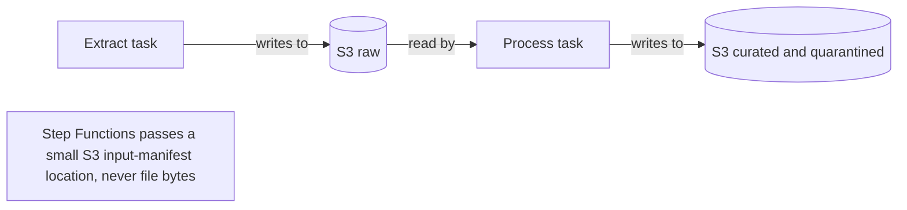

| | Extraction | Processing |
|---|---|---|
| Responsibility | Retrieve the original file | Run Part 1's ETL rules |
| Network | Needs outbound internet access for data.gov.sg; private S3 route | S3 gateway plus ECR, Logs, and Glue interface endpoints; no internet route |
| IAM | Write to `raw` only | Read `raw`, write to the other four output groups |
| Failure mode | The source API is unavailable, or the download fails | Validation or transformation logic fails |
| Scaling | Driven by download size and duration | Driven by CPU and memory needed to transform the data |

The practical benefit shows up during recovery. If processing fails after a successful download, only processing needs to be retried. The original file is already sitting in `raw`, so nothing needs to be downloaded again. This also means the extract task's IAM role and the process task's IAM role can each be scoped to exactly what that one task needs, and neither task needs the other's permissions.

## 6. Orchestration: Step Functions Standard, Not Express

| | Standard Workflows | Express Workflows |
|---|---|---|
| Maximum duration | 1 year | 5 minutes |
| Execution history | Built in, viewable per execution | Sent to CloudWatch Logs |
| Execution guarantee | Exactly once, except for explicit retries | At least once (asynchronous) or at most once (synchronous) |
| Run a Job (`.sync`) integration with ECS | Supported | Not supported |
| Pricing | Per state transition | Per request, duration, and memory used |

The deciding factor is simple: the workflow needs to start the extract task, wait for it to actually finish, and only then start the process task. Standard Workflows support this directly through the `ecs:RunTask.sync` integration pattern, where Step Functions itself waits for the ECS task to complete before moving to the next state. Express Workflows only support request-response style integrations for ECS, not this wait-for-completion pattern, so they cannot be used to coordinate two sequential tasks this way.

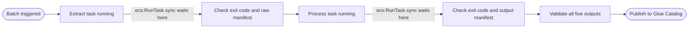

Standard Workflows also keep a full execution history for every run, and support **redrive**: restarting a failed, aborted, or timed out execution from the point where it stopped, instead of from the very beginning. A Standard execution can be redriven if all of the following are true: it finished within the last 14 days, its status is not `SUCCEEDED`, its total open time has not passed the 1 year maximum, and it has fewer than 24,999 recorded events. For a monthly or daily batch job, this window is generous.

One precision worth stating clearly: "exactly once" describes how Step Functions itself tracks a workflow's progress. It does not mean the container code inside a task can never run twice. A retry, or a redrive, can still invoke the same task a second time. That is exactly why the process task's own code has to tolerate being run more than once on the same input, which is covered in section 15.

Standard is required for a second, independent reason covered in section 4.5: waiting for an asynchronous GuardDuty malware-scan result before starting the process task also needs a task-token callback (`waitForTaskToken`), which Express does not support either.

## 7. Why Not AWS Batch

AWS Batch can also run containers on Fargate, but it adds job queues, scheduling priorities, and managed compute environments on top.

| | ECS tasks on Fargate (this design) | AWS Batch |
|---|---|---|
| Execution | Direct task invocation from Step Functions | Job submission into a queue |
| Scheduling | Step Functions decides the order | Batch's own scheduler manages many jobs |
| Workload shape | Two defined, sequential stages | Large numbers of independent jobs |
| Resource allocation | Set per task | Allocated through compute environments |

This pipeline has exactly two well defined, sequential steps. AWS Batch's job queue and scheduling layer solves a problem this pipeline does not have: deciding which of many competing jobs should run next, and with what priority. Adding Batch here would mean operating an extra service without a matching benefit.

**Reconsider AWS Batch when:** HDB needs to process a large number of independent files or datasets at the same time, and needs priority queues or dynamic compute allocation across them. That is a different shape of problem from this one.

## 8. Why Not Apache Airflow

Apache Airflow, run as Amazon Managed Workflows for Apache Airflow (MWAA), is a general purpose scheduler for complex, interdependent pipelines, with a large library of ready-made integrations and a Python-native way of defining a pipeline as a DAG.

The reason it is not used here is operational weight relative to what this pipeline actually needs. MWAA runs a persistent environment (a scheduler, a web server, and workers) that has an hourly cost whether or not a pipeline is actually running. Step Functions has no such standing cost. It is billed per state transition, which suits a workload that runs on a schedule with only two real steps.

Airflow's strength is coordinating many pipelines, owned by different teams, with complex branching, backfills, and a shared operational view across all of them. This pipeline is a single, mostly linear flow. That flexibility is not needed yet.

**Reconsider Airflow or MWAA when:** HDB already standardizes broader data platform orchestration on Airflow across many pipelines and teams. Running a second orchestration tool alongside an existing Airflow estate would add operational overhead rather than remove it. If Airflow is already the house standard, this pipeline should probably join it rather than introduce Step Functions as a second tool.

## 9. Packaging: Docker And Amazon ECR

Step Functions does not run a container directly. It tells ECS to launch a task. ECS then uses Fargate to run the container image that has already been pushed to Amazon ECR.

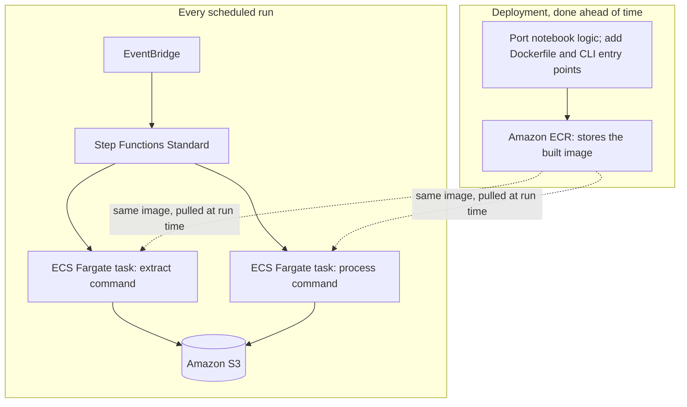

In a deployment, the image would be built and pushed to ECR ahead of time, not rebuilt on every scheduled run. The checked-in Part 1 artifact is a Jupyter notebook, so this image does not yet exist.

**One image, two commands after adaptation.** The extract task and process task can share one image and use different commands. The following commands are *proposed entry points*, not commands that work in the submitted repository:

```text
# Extract task
python -m src.main extract

# Process task
python -m src.main process
```

Implementation requires moving the notebook's extraction and transformation cells into callable modules, making S3 the raw and output store, adding streamed multipart upload for large downloads, and creating the Dockerfile and two task definitions. Each task definition then points at the same image but sets its own command, CPU, memory, IAM role, and subnet. Step Functions supports command overrides.

**Two IAM roles per task, not one.** A task execution role lets ECS pull the image from ECR and send logs to CloudWatch. A task role is what the Python application inside the container actually assumes, and is what should be scoped to the specific S3 prefixes that task is allowed to touch. These are two different roles serving two different purposes, and should not be merged into one broad role for convenience.

**What this means for the assessment.** Actual coding is not required for Part 2. Docker, ECR, and the two ECS task definitions are a production deployment path, not a claimed working deployment. Part 1's notebook and outputs can be reviewed locally without building a container.

## 10. Diagram 2: Tableau Reads The Data Privately

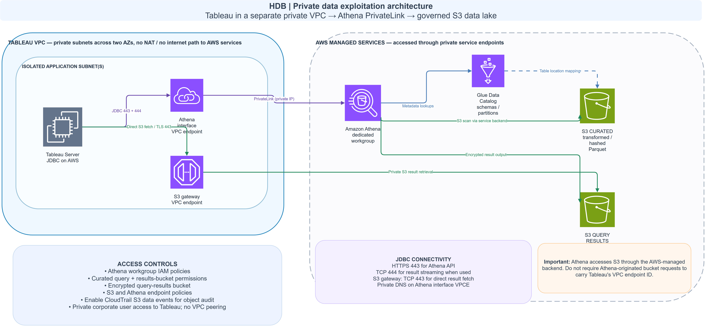

### 10.1 What Each Box Means

| Box | What it means |
|---|---|
| Tableau Server on AWS | The tool the Data Science Team uses. Sits in private subnets in a separate VPC. Two AZs are the production deployment assumption. Users reach Tableau through a private corporate path (for example VPN or Direct Connect); that user access path is outside these data-flow diagrams. Authentication to Athena is covered in section 10.5. |
| Athena interface VPC endpoint | A private connection point inside Tableau's VPC, using AWS PrivateLink. Tableau's Athena driver talks to this, never to the public internet. |
| S3 gateway VPC endpoint | A private route to S3, used if the Athena driver reads result files directly from S3. |
| Amazon Athena | The query engine. Required because the assessment specifically asks for the Athena driver. |
| Glue Data Catalog | Tells Athena where the curated tables live and what their columns are. It does not hold a copy of the data itself. |
| S3 curated data | Only the `transformed` and `hashed` data is exposed here. `raw` and `quarantined` are never reachable from this side. |
| S3 query results | A separate bucket for Athena's query output, encrypted, with access limited to this workgroup. |

### 10.2 How A Query Flows, Step By Step

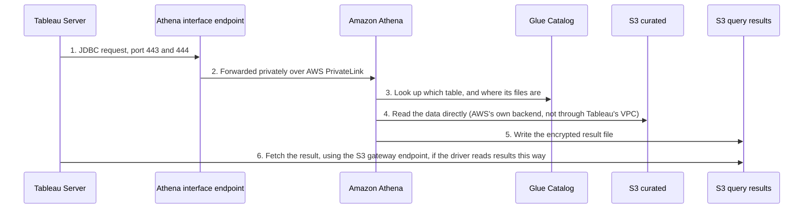

Port 443 carries the main Athena API call. Port 444 is a confirmed requirement of the Athena JDBC 3.x driver, which uses it to stream query results back to the client. This means the interface endpoint's own security group needs an inbound rule for port 444 from Tableau, not only port 443, or result streaming will fail even though the API calls on 443 succeed.

Streaming results also needs one extra IAM permission beyond the usual Athena actions: `athena:GetQueryResultsStream`. This action is not part of the plain Athena API. It exists specifically for the ODBC and JDBC drivers, and has to be added to Tableau's role explicitly, or the driver's streaming fetch mode will be denied even with an otherwise correct Athena policy.

### 10.3 A Common Mistake This Design Avoids

It is tempting to write an S3 bucket policy that only allows requests coming from Tableau's own VPC endpoint. This does not work for Athena. AWS documents that Athena reads S3 data from its own managed backend, and that this traffic cannot be tied to a specific VPC endpoint ID (see the [Athena S3 permissions page](https://docs.aws.amazon.com/athena/latest/ug/s3-permissions.html)). A bucket policy written this way would block Athena's own queries. Access should instead be controlled with normal IAM and bucket policies scoped to the right roles.

### 10.4 Four Separate Questions

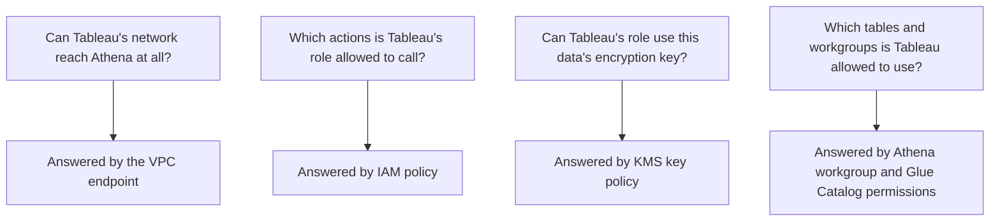

A private network path only answers the first question. It says nothing about the other three. All four have to be set up correctly, or access will either fail unexpectedly or be wider than intended.

### 10.5 How Tableau Actually Authenticates To Athena

A private connection to Athena is not the same as being logged into it. Tableau's own documentation for the Athena connector describes two different ways to sign in, and they are not interchangeable.

**Option A: a static AWS access key and secret key.** This is the connector's documented basic setup. The server field takes the form `athena.[region].amazonaws.com`, the S3 staging directory field takes the query results bucket, and the AWS access key ID and secret access key are entered in the connection dialog's Username and Password fields. It creates a long-lived credential that must be rotated and protected in Tableau Server's supported saved-credential mechanism. Placing a key in Secrets Manager alone does not make Tableau's connector retrieve it; that would require an additional, tested integration.

**Option B: IAM OAuth, through an external identity provider.** Tableau also supports signing in through an OpenID Connect identity provider that AWS IAM already trusts. AWS validates the token from that identity provider, maps its claims to an IAM role, and lets Tableau assume that role for the length of the session. No static access key exists in this model at all. Setting it up needs an OIDC identity provider already registered in IAM, an IAM role and policy mapped to that provider's claims, and an OAuth configuration file installed on both Tableau Server and every Desktop client involved.

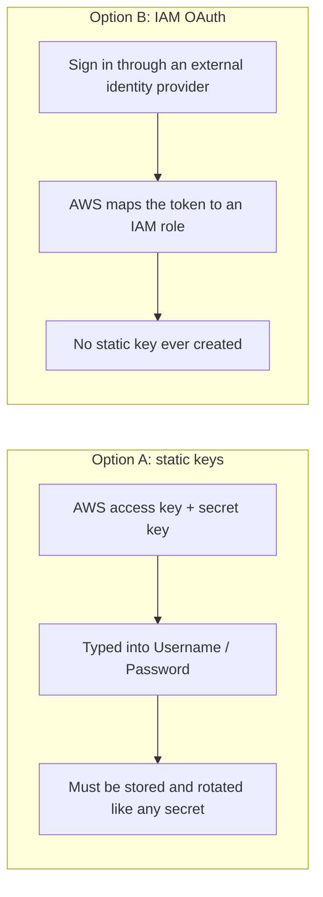

Option B avoids a standing AWS access key and is recommended **if** HDB has a supported identity provider and Tableau can reach its sign-in endpoints over an approved private access path. A no-NAT Tableau VPC cannot silently reach a public identity provider. If those prerequisites are unavailable, Option A with a credential managed by Tableau Server is the explicit starting assumption.

One detail worth confirming before either option is finalized: whether the deployed Athena JDBC driver falls back to an EC2 instance role automatically when the Username and Password fields are left blank. Tableau's own documentation does not state this either way for Tableau Server running on EC2, so it should be tested directly against the actual driver version rather than assumed.

A workgroup can be added directly to the server string, for example `athena.us-east-1.amazonaws.com:443;Workgroup=hdb-tableau`, which is how the dedicated workgroup mentioned throughout this document is actually selected in practice, not through a separate field.

One encryption detail matters here too. The query results bucket in this design uses SSE-KMS, meaning S3 itself decrypts the object when a permitted identity reads it. This is different from CSE_KMS, a client side encryption mode where the JDBC driver's direct S3 result fetcher cannot decrypt the object at all, only the slower streaming fetcher can. Using SSE-KMS, as this design does, keeps both result fetch modes available.

## 11. Why Two VPCs Instead Of Three

| | Two VPCs (this design) | Three VPCs (an alternative) |
|---|---|---|
| Extraction and processing | Same VPC, separated by subnet | Two separate VPCs |
| Tableau | Its own VPC, same as either option | Its own VPC |
| Things to operate | Fewer route tables, security groups, and endpoints | An extra VPC boundary, without adding any extra control over who can read the data |
| Matches the assessment | Yes: private networks for the platform, plus one more for Tableau | Also satisfies it, but adds a boundary the assessment did not ask for |

Splitting extraction and processing into two independent tasks (section 5) argues for giving them separate IAM roles, separate security groups, and separate subnets. It does not, by itself, argue for a second VPC. The two-VPC, three-subnet design already gives each task its own network posture: the extract subnet has a route out through NAT, and the process subnet has none at all. A network boundary controls where traffic can travel. It does not decide who is allowed to read a file. That job belongs to IAM and S3 permissions, and they work the same way regardless of how many VPCs there are.

A three VPC design becomes worth it if HDB's real policy requires network level separation, not just subnet level separation, between anything that talks to the internet and anything that does not, or if the processing task needs to reach some other internal system that should never be reachable from the extraction subnet.

## 12. Why Fargate Is Used For Extraction And Processing

Part 1 includes a working local notebook, not an AWS Lambda deployment or adapter. Lambda currently supports up to 10,240 MB of temporary storage and a 15 minute run time; a file over 100 MB could fit if the measured processing time and memory use also fit. File size alone does not rule Lambda out.

The current source files are about 4.16 MB, 29.4 MB, and 3.07 MB. Their file sizes alone would not exceed Lambda's temporary-storage limit; an actual Lambda run would still need a packaged implementation and runtime and memory measurement.

Even so, both the extract task and the process task use ECS Fargate as the main compute, for four reasons.

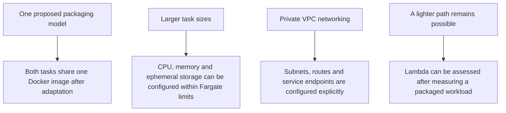

1. One packaging model is possible after adaptation. Both tasks can share a Docker image and run different commands (section 9), leaving one image build and patch path.
2. Configurable task size. Fargate also has CPU, memory, storage, and runtime resource constraints, but its task sizes can be selected for measured workloads. Streaming download and multipart upload address files over 100 MB without loading a whole file into memory. If measured processing outgrows one container, Glue with Spark is a possible later redesign of the processing code.
3. Fargate attaches each task to a configured subnet. The extract and process task definitions can choose different subnet roles, route tables, and security groups. The ECR, Logs, Glue, and S3 paths in section 4.1 are required for the isolated task.
4. Lambda remains an alternative for a future packaged workload if a benchmark shows that extraction and processing fit its limits. The current notebook would need adaptation for either Lambda or Fargate.

If a future benchmark shows every real run comfortably fits inside Lambda's limits with room to spare, Lambda becomes a reasonable simplification for extraction. That decision should be made from a measurement, not a guess.

## 13. IAM And KMS: Two Different Locks

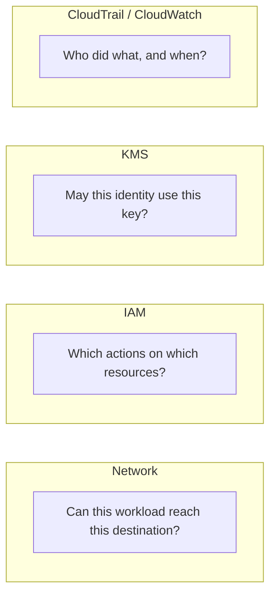

These four controls answer four separate questions, and none of them can stand in for another. A private network path does not grant a permission. An IAM policy does not decrypt an encrypted object by itself, if the key policy has not also allowed it. Logging does not block anything, it only records what happened.

| Identity | Allowed to do | Not allowed to do |
|---|---|---|
| Extract task role | Write to its own raw prefix only; read exactly one Secrets Manager secret, the data.gov.sg API key | Read curated or quarantined data, use their encryption key, or read any other secret |
| Process task role | Read raw, write cleaned / transformed / hashed / quarantined, update the Catalog | Touch unrelated buckets, or act as the Tableau identity |
| GuardDuty service role | Read and tag objects in `raw` only (`s3:GetObject`, `s3:PutObjectTagging`); decrypt with the raw KMS key to scan | Read curated or quarantined data, or tag objects outside `raw` |
| Tableau / Athena role | Use its own workgroup, read curated tables, write to its own results prefix, stream results (`athena:GetQueryResultsStream`) | Read raw or quarantined data, or use other workgroups |

The EventBridge schedule needs permission to start the state machine. The Step Functions execution role needs `ecs:RunTask`, `ecs:DescribeTasks`, `ecs:StopTask`, the EventBridge managed-rule actions required by `.sync`, and `iam:PassRole` scoped to the two ECS task and execution roles. These are control-plane permissions; they do not belong on the containers' task roles. The [ECS integration guide](https://docs.aws.amazon.com/step-functions/latest/dg/connect-ecs.html) lists the exact policy shape.

S3 already encrypts every object by default. The design here adds a customer managed KMS key on top of that as an extra, optional layer of control, since it is a small addition and gives clearer control over who may decrypt what. One key, with correctly scoped IAM and S3 policy, is enough for this size of project. A separate key per data zone can be added later if a real governance requirement calls for it.

## 14. Recovery: What Happens When A Task Fails

Splitting extraction and processing into two independent tasks (section 5) is one of the main reasons recovery is straightforward here.

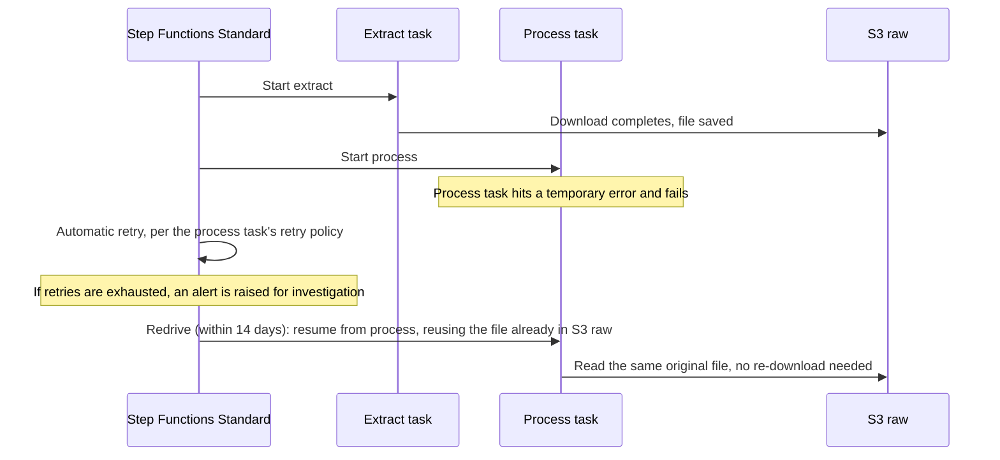

Suppose extraction takes 15 minutes and processing fails 10 minutes in. Without independent tasks, rerunning one combined script might repeat the extraction unnecessarily. With two independent tasks, the original file is already sitting in S3, so processing can simply be retried against it.

Different failures call for different responses, not the same blind retry every time:

| Failure | Recovery |
|---|---|
| Temporary API timeout, or an HTTP 429 from data.gov.sg | Retry extraction with exponential backoff and jitter, respecting any stated rate limit |
| The process container crashes or hits a transient error | Retry processing using the file already in S3 raw |
| The source data is genuinely invalid | Quarantine the affected records, or fail validation, according to the defined quality rules. Do not blindly retry, since a malformed file will not fix itself by being processed again |

Step Functions Standard supports both automatic retries (defined per state, with backoff) and redrive, which resumes a failed execution from where it stopped rather than from the very beginning. Redrive is only available while the execution is within its 14 day eligibility window, has not exceeded the 1 year maximum open time, and has fewer than 24,999 recorded events, all comfortable margins for a monthly or daily batch.

Step Functions handles workflow recovery: it knows which step failed and can resume from there. It does not, by itself, guarantee that data stays consistent if a task happens to run twice. That is a property the pipeline's own code has to provide, which is what section 15 covers.

## 15. Idempotency: Why Retries Must Be Safe

Idempotency means running the same operation more than once produces the same result as running it once.

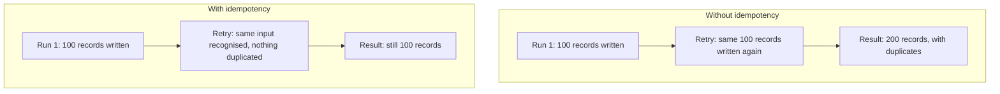

Two levels need this, not just one:

* **Extraction:** downloading the same source version twice should not create two separate logical copies of the same raw file.
* **Processing:** running the same transformation twice against the same input snapshot should not append duplicate output rows, or publish a half finished result.

This is a different problem from Part 1's own deduplication. Part 1's deduplication handles duplicate resale records that exist within the data itself. Pipeline idempotency handles duplicate executions of the whole pipeline. Both are needed. Neither one replaces the other.

Three safeguards make this practical:

1. **Source version tracking.** Record the dataset ID together with a source version identifier or a verified content checksum, so a previously downloaded file is recognised rather than re-saved as a new copy.
2. **Deterministic processing.** The process task receives an exact manifest of the three raw S3 object versions and a processing code version. Running those same inputs through the same code version should produce an equivalent result every time.
3. **Controlled publication.** Write outputs to a staging location first, verify that all five expected outputs exist and are consistent, and only then publish. A retry should never expose a partially generated output, or create a second copy of the same logical records.

For raw objects, S3 supports `If-None-Match` conditional creation at `PutObject` or **`CompleteMultipartUpload`**. The latter is the relevant operation for this design's large-file uploads; putting the condition only on `CreateMultipartUpload` or individual parts would not protect the final key. A competing completion can return `412 Precondition Failed`; a concurrent delete can cause `409 Conflict` and require a fresh multipart upload. Abort unfinished uploads and expire abandoned parts with a bucket lifecycle rule.

## 16. Incremental Ingestion: Avoiding Unnecessary Re-Downloads

The pipeline covers three source datasets, not one, and they do not all get updated at the same time or in the same way:

| Source dataset | Period relevant to this assessment |
|---|---|
| Approval date resale data, 2000 to February 2012 | January and February 2012 only |
| Registration date resale data, March 2012 to December 2014 | Entire dataset |
| Registration date resale data, January 2015 to December 2016 | Entire dataset |

Because of this, the pipeline should not assume that only the most recently published dataset can change. All three need an independent freshness check every run.

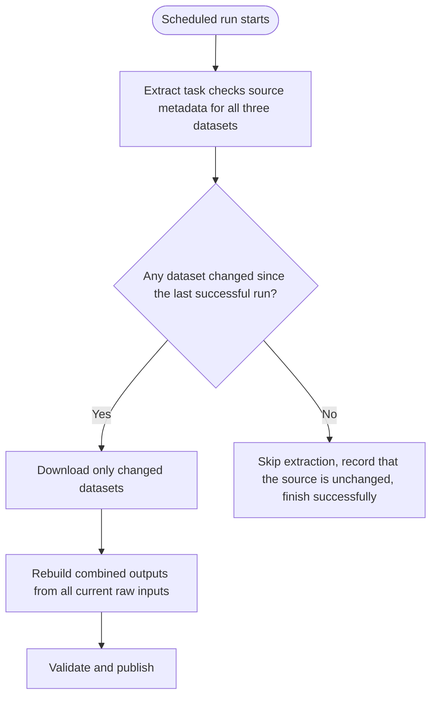

The extract task already has the only approved public egress path, so it can check metadata before downloading. The workflow can read the extract task's small S3 status manifest and use a Choice state to skip processing when nothing changed. This avoids adding an unshown Lambda that would also need a public egress path.

A small ingestion record is kept per dataset: its ID, its source version or update timestamp, the downloaded file's checksum, its S3 location, and its processing status.

One safeguard matters here: a changed metadata timestamp is a hint that content might have changed, not proof. Before triggering an expensive reprocess, the file should be downloaded and its content checksum compared against the last known value, and reprocessing should only proceed if that checksum actually differs.

The Part 1 result is one combined dataset and its resale identifier depends on the average price for a month, town, and flat type. A source correction may also change deduplication or validation outcomes. Therefore this simple production design rebuilds the combined outputs from the latest retained raw version of **all three** inputs whenever any input's checksum changes. It saves unnecessary downloads while preserving the same semantics as the notebook. Processing only affected groups would require a separately implemented dependency-aware incremental algorithm.

## 17. Scaling To 100 Times The Data

Extraction and processing scale differently, so they are considered separately.

| Component | Current design | At 100 times the data |
|---|---|---|
| Extraction | ECS Fargate, streaming download, multipart S3 upload | Same approach; avoid re-downloading datasets that have not changed (section 16) |
| Orchestration | Step Functions Standard | Download only changed datasets; rebuild combined outputs from all current raw versions if any changed |
| Processing | ECS Fargate running Part 1's Python code | Raise the task's CPU and memory first; move to AWS Glue with Spark only if a real benchmark shows a single container is not enough |
| Storage | Amazon S3 | Keep raw files immutable; partition curated output by something analytically useful |
| Analytics | Athena over Parquet | Partition pruning and sensibly sized files, so a query does not need to scan the whole dataset |

The first optimisation is to skip a run when no source changed and avoid re-downloading unchanged files. If one source changes, all three current raw versions still feed the combined transformation. Any future partial recomputation must preserve cross-source deduplication and group averages.

**Should there be five separate tables, one per source dataset?** No. A dataset ID identifies where a file came from. It is not, by itself, a useful way to split analytical data. The natural operation across these three sources is to line up their columns and stack the rows together, not to join them side by side, since they cover different, non-overlapping time periods of the same kind of transaction. Splitting historical periods into separate source files for lineage purposes does not mean the curated data needs to be split the same way. The curated data should instead be partitioned by something a query actually filters on, such as transaction year and month.

```text
s3://hdb-data-lake/
  raw/
    dataset_id=A/source_version=001/
    dataset_id=B/...
    dataset_id=C/...
  staging/
    run_id=20260927-001/
  cleaned/
    year=2012/month=01/
    year=2012/month=02/
    year=2013/...
  transformed/
  quarantined/
  hashed/
```

This keeps full source lineage in `raw`, while letting `cleaned`, `transformed`, and `hashed` be organised by the attributes that actually matter for a query, such as year and month, so Athena can skip whole partitions it does not need to scan.

## 18. Security

* No public inbound path exists in either VPC. The extract subnet has a NAT route for public data.gov.sg calls; security group egress and DNS controls should limit its destinations where practical. Tableau's users enter through a separately governed private corporate path.
* Raw, curated, and quarantined data sit in separate S3 locations with separate IAM permissions. Even if the extract task were compromised, it could not read curated or quarantined data, and could not decrypt it either.
* Tableau queries curated data through Athena PrivateLink and can directly fetch **query results** through its S3 gateway endpoint when the driver uses the S3 fetcher. Its IAM and endpoint policies must limit direct S3 access to the results location; Athena still needs the caller's permission to read curated objects through its service backend. The bucket policy trap in section 10.3 is avoided.
* Enable S3 Block Public Access and TLS-only bucket policies. Enable CloudTrail S3 data events for the lake and results buckets if object-level audit is required; those events are not on by default.
* Every object landing in `raw` is scanned automatically by GuardDuty Malware Protection for S3 before the process task is allowed to read it; a threat verdict blocks processing rather than being silently logged. This checks file content, which is a different question from the completion-manifest and checksum checks elsewhere, which only confirm the bytes match what was already downloaded (section 4.5).

## 19. Scalability

* The extract task and the process task can each be resized independently, without changing the network design.
* Curated data is stored as Parquet, split by transaction year and month, which reduces how much data Athena has to scan compared to reading raw CSV files directly.
* Athena's compute is separate from storage, and workgroup settings cap how much a single query is allowed to scan.
* Section 17 covers what changes if the data grows substantially.

## 20. Maintainability

* A production adapter can reuse Part 1's Python rules after extracting them from the notebook and replacing local file paths with S3-backed inputs and outputs. Spark is a later option only if measured scale requires it.
* The proposed deployment packages both entry points in one Docker image, with the task's command choosing which one runs (section 9).
* The Glue Data Catalog is only updated on purpose, after a successful run. There is no automatic crawler that could quietly change the table structure.
* Retry and redrive behaviour is built into Step Functions Standard rather than hand rolled (section 14).

## 21. Performance

* Streaming and multipart upload mean a large file never has to sit fully in memory. Storage is sized to the task, not capped by a fixed platform limit.
* Curated Parquet, with sensible partitioning, reduces how much data Athena scans and how much a query costs, compared to scanning raw CSV.
* Athena being serverless does not guarantee fast queries on its own. If dashboard load grows, that should be measured and addressed directly, rather than assumed away in advance.

## 22. Assumptions Made In This Design

1. Tableau Server is hosted on AWS, not Tableau Cloud. Tableau Cloud would need a different connection method.
2. Every component shown is deployed in the same AWS region.
3. A production implementation extracts and adapts Part 1's pandas logic into callable code and packages it as a container; this has not been done in the submission. Moving to Spark would be a further rewrite.
4. The five output groups, and the fact that the short resale identifier can collide between different records, are taken directly from the completed Part 1 pipeline, not assumed.
5. Spreading resources across multiple availability zones is treated as a production goal. Running in a single availability zone is an acceptable, clearly stated way to save cost for a lower frequency batch job like this one.
6. No cost numbers are given without first fixing how often the batch runs, how large the files are, and how many queries Tableau sends. The [AWS Pricing Calculator](https://calculator.aws/) should be used once those numbers are known.
7. A data.gov.sg API key has been registered separately and placed in Secrets Manager ahead of time. Provisioning that key is a one time manual step, not something the pipeline does for itself.
8. The baseline Tableau connection uses a static access key in Tableau Server's credential mechanism. IAM OAuth is an optional alternative only where an approved identity provider and a reachable sign-in path exist. Neither connection has been tested here.
9. GuardDuty Malware Protection for S3 is enabled on the `raw` bucket, and Step Functions is assumed to wait on its scan-result event before starting the process task. The exact EventBridge rule and task-token wiring is further implementation detail, not built or tested here.

## 23. Questions A Reviewer Might Ask

**Why two Fargate tasks instead of one script that does everything?**
Independent failure handling and independent scaling. See section 5.

**Why Step Functions Standard and not Express?**
Only Standard supports waiting for an ECS task to finish before starting the next one, through `ecs:RunTask.sync`. See section 6.

**Why not AWS Batch, or Apache Airflow?**
Both add operational weight this pipeline does not need yet: Batch adds job queuing for many independent jobs, Airflow (MWAA) runs a persistent environment with an ongoing cost. See sections 7 and 8.

**Why Fargate, if Lambda could handle today's files?**
The local notebook is not a Lambda deployment. Lambda could be viable after packaging and measurement; Fargate is chosen for configurable task sizing and the same container packaging across both tasks. See section 12.

**Why two VPCs and not three?**
Subnet level separation already satisfies the requirement, and already gives the two tasks separate network postures. A third VPC becomes worth it only if HDB's actual policy demands network level, not just subnet level, isolation. See section 11.

**Is S3 sitting inside a VPC?**
No. It is a regional AWS service. A gateway endpoint gives it a private route, it does not move S3 into the VPC.

**Where is the data.gov.sg API key stored?**
In AWS Secrets Manager, read once by the extract task's own IAM role when it starts. It is not stored in the container image, an environment variable, or source control. See section 4.4.

**How does Tableau actually log into Athena, an IAM role or a password?**
The baseline is a static AWS access key and secret key saved through Tableau Server's credential mechanism. IAM OAuth is possible if HDB has a supported identity provider reachable from this private environment. See section 10.5.

**Does the Athena JDBC driver need any IAM permission beyond the usual Athena actions?**
Yes. Streaming results back over port 444 needs `athena:GetQueryResultsStream` specifically, which is not part of the standard Athena API and has to be added to Tableau's role by name. See sections 10.2 and 13.

**How is recovery actually done if processing fails?**
Step Functions retries the process task automatically. If retries are exhausted, redrive can resume from the failed step within 14 days, reusing the file already downloaded, without re-running extraction. See section 14.

**Does exactly-once execution mean the code can never run twice?**
No. It describes Step Functions' own orchestration tracking, not a guarantee about the container. Retries and redrives can still invoke a task again, so the pipeline's own code has to be idempotent. See sections 6 and 15.

**What happens if the dataset grows 100 times larger?**
Avoid re-downloading unchanged datasets, size the process task from measured memory and runtime, and consider Glue Spark if a single container is insufficient. Keep curated data partitioned by year and month. See section 17.

**Why not one table per source dataset?**
A dataset ID identifies where a file came from, not something a query benefits from filtering on. The right operation is to combine the three sources' rows together, not to keep them apart. See section 17.

**Does anything check incoming files for malicious content, not just checksum integrity?**
Yes. GuardDuty Malware Protection for S3 scans every new object in `raw` automatically and tags the result; the process task only starts after a clean scan. A checksum only confirms the bytes match a prior download, not that the content is safe. See section 4.5.

## 24. References

* [AWS Architecture Icons](https://aws.amazon.com/architecture/icons/)
* [data.gov.sg dataset download API](https://guide.data.gov.sg/developer-guide/dataset-apis/download-dataset)
* [data.gov.sg API keys and rate limits](https://guide.data.gov.sg/developer-guide/api-overview/how-to-request-an-api-key)
* [Amazon VPC gateway endpoints for S3](https://docs.aws.amazon.com/vpc/latest/privatelink/vpc-endpoints-s3.html)
* [Amazon ECR endpoints required for private Fargate image pulls](https://docs.aws.amazon.com/AmazonECR/latest/userguide/vpc-endpoints.html)
* [AWS Glue interface endpoint](https://docs.aws.amazon.com/glue/latest/dg/vpc-interface-endpoints.html)
* [Athena interface VPC endpoint](https://docs.aws.amazon.com/athena/latest/ug/interface-vpc-endpoint.html)
* [Athena S3 permissions, including the VPC endpoint caveat](https://docs.aws.amazon.com/athena/latest/ug/s3-permissions.html)
* [Tableau's Amazon Athena connector](https://help.tableau.com/current/pro/desktop/en-us/examples_amazonathena.htm)
* [Set up Amazon Athena IAM OAuth in Tableau](https://help.tableau.com/current/pro/desktop/en-us/amazon_athena_idp.htm)
* [Athena JDBC 3.x driver, including the port 444 and `athena:GetQueryResultsStream` requirements](https://docs.aws.amazon.com/athena/latest/ug/jdbc-v3-driver.html)
* [Lambda ephemeral storage](https://docs.aws.amazon.com/lambda/latest/dg/configuration-ephemeral-storage.html) and [Lambda quotas](https://docs.aws.amazon.com/lambda/latest/dg/gettingstarted-limits.html)
* [Fargate ephemeral storage](https://docs.aws.amazon.com/AmazonECS/latest/developerguide/fargate-task-storage.html)
* [Step Functions ECS integration and the `.sync` pattern](https://docs.aws.amazon.com/step-functions/latest/dg/connect-ecs.html)
* [Step Functions Standard vs Express Workflows](https://docs.aws.amazon.com/step-functions/latest/dg/choosing-workflow-type.html)
* [Step Functions redrive](https://docs.aws.amazon.com/step-functions/latest/dg/redrive-executions.html)
* [GuardDuty Malware Protection for S3](https://docs.aws.amazon.com/guardduty/latest/ug/gdu-malware-protection-s3.html)
* [Monitoring S3 object scans with EventBridge](https://docs.aws.amazon.com/guardduty/latest/ug/monitor-with-eventbridge-s3-malware-protection.html)
* [Amazon S3 conditional writes](https://docs.aws.amazon.com/AmazonS3/latest/userguide/conditional-writes.html)
* [AWS KMS key policies](https://docs.aws.amazon.com/kms/latest/developerguide/key-policies.html)
* [S3 SSE-KMS encryption](https://docs.aws.amazon.com/AmazonS3/latest/userguide/UsingKMSEncryption.html)
* [AWS Pricing Calculator](https://calculator.aws/)

Last reviewed: 27 September 2026, against the completed Part 1 pipeline and the assessment's stated submission requirements.
